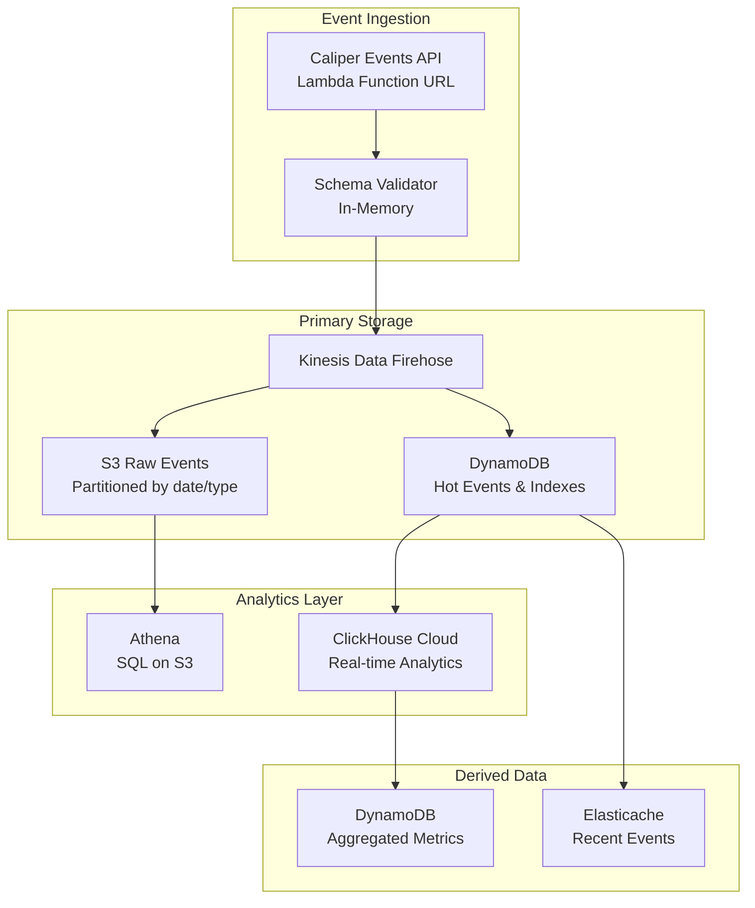
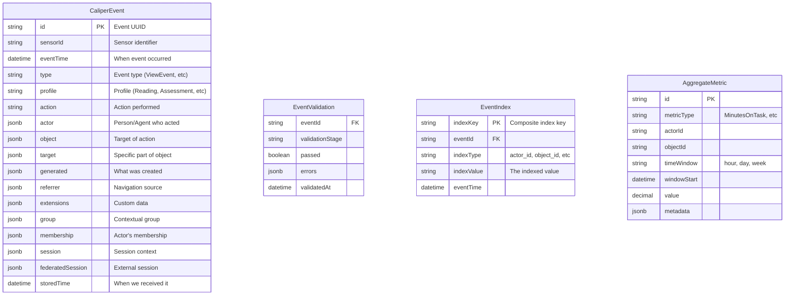

# Caliper Analytics v1.2 Data Models

## Overview

Caliper Analytics is an event-driven specification that captures learning activities. Unlike OneRoster (which manages static roster data), Caliper focuses on streaming behavioral events. This fundamental difference drives our architectural decisions.

## Core Architecture



## Data Model Strategy

### Why Not 69 Tables?

The Caliper spec defines 69 entity types and 21 event types, but implementing these as separate tables would be:
1. **Unnecessarily complex** - Most queries need to traverse multiple entity types
2. **Poor for analytics** - Event analysis requires joining across many tables
3. **Inflexible** - Adding new entity types requires schema changes

### Our Approach: Polymorphic Event Storage



## Event Storage Patterns

### 1. Hot Storage (DynamoDB)
- **Recent Events** (last 7-30 days)
- **Primary Key**: `sensorId#eventTime`
- **GSI-1**: `actorId#eventTime` - Find events by actor
- **GSI-2**: `objectId#eventTime` - Find events by learning object
- **GSI-3**: `sessionId#eventTime` - Find events by session
- **TTL**: Auto-expire after 30 days

### 2. Cold Storage (S3 + Athena)
- **All Events** (permanent archive)
- **Partitioning**: `/year/month/day/hour/profile/`
- **Format**: Parquet for efficient querying
- **Compression**: Snappy
- **Query via**: Athena SQL

### 3. Real-time Analytics (ClickHouse)
- **Materialized Views** for common queries
- **Pre-aggregated** time-series data
- **Sub-second** query performance

## Detailed Entity Models

### Core Event Structure

```typescript
// Base Event - All Caliper events extend this
interface CaliperEvent {
  id: string;                    // UUID
  type: EventType;               // 21 types from spec
  eventTime: string;             // ISO 8601
  actor: Agent;                  // Who performed action
  action: Action;                // 80 actions from spec
  object: Entity;                // Target of action
  
  // Optional fields
  target?: Entity;               // Specific part of object
  generated?: Entity;            // What was created
  referrer?: Entity;            // Navigation source
  group?: Organization;          // Context
  membership?: Membership;       // Actor's role
  session?: Session;             // Session info
  federatedSession?: LtiSession; // External session
  extensions?: Record<string, any>;
}

// All entities are stored as JSON within events
interface Entity {
  id: string;                    // IRI
  type: EntityType;              // 69 types from spec
  name?: string;
  description?: string;
  dateCreated?: string;
  dateModified?: string;
  extensions?: Record<string, any>;
}
```

### Profile-Specific Event Models

```typescript
// Assessment Profile Events
interface AssessmentEvent extends CaliperEvent {
  type: 'AssessmentEvent';
  object: Assessment;
  generated?: Attempt;
}

interface AssessmentItemEvent extends CaliperEvent {
  type: 'AssessmentItemEvent';
  object: AssessmentItem;
  generated?: Response;
}

// Media Profile Events  
interface MediaEvent extends CaliperEvent {
  type: 'MediaEvent';
  object: MediaObject;
  target?: MediaLocation;
}

// Reading Profile Events
interface ViewEvent extends CaliperEvent {
  type: 'ViewEvent';
  object: DigitalResource;
  target?: Frame;
}

// Tool Use Profile Events
interface ToolUseEvent extends CaliperEvent {
  type: 'ToolUseEvent';
  object: SoftwareApplication;
  generated?: AggregateMeasure;
}
```

### Key Entity Types (Stored as JSON)

```typescript
// Actors
type Agent = Person | SoftwareApplication | Organization;

interface Person extends Entity {
  type: 'Person';
}

interface SoftwareApplication extends Entity {
  type: 'SoftwareApplication';
  version?: string;
}

// Learning Objects
interface DigitalResource extends Entity {
  type: 'DigitalResource';
  learningObjectives?: LearningObjective[];
  keywords?: string[];
  isPartOf?: Entity;
}

interface Assessment extends DigitalResource {
  type: 'Assessment';
  maxAttempts?: number;
  maxSubmits?: number;
  maxScore?: number;
}

interface AssessmentItem extends Entity {
  type: 'AssessmentItem';
  isPartOf: Assessment;
  maxAttempts?: number;
  maxSubmits?: number;
  maxScore?: number;
}

// Results & Attempts
interface Attempt extends Entity {
  type: 'Attempt';
  assignee: Agent;
  assignable: AssignableDigitalResource;
  count?: number;
  startedAtTime?: string;
  endedAtTime?: string;
  duration?: string; // ISO 8601 duration
}

interface Result extends Entity {
  type: 'Result';
  attempt?: Attempt;
  maxResultScore?: number;
  resultScore?: number;
  comment?: string;
}

// Metrics (for ToolUseEvent)
interface AggregateMeasure extends Entity {
  type: 'AggregateMeasure';
  metric: MetricType;
  value: number;
}

enum MetricType {
  MinutesOnTask = 'MinutesOnTask',
  WordsRead = 'WordsRead',
  SkillsMastered = 'SkillsMastered',
  StandardsMastered = 'StandardsMastered',
  UnitsCompleted = 'UnitsCompleted',
  UnitsPassed = 'UnitsPassed',
}
```

## Query Patterns

### 1. Time-Series Queries
```sql
-- Student engagement over time (Athena)
SELECT 
  date_trunc('hour', eventTime) as hour,
  actor.id as student_id,
  COUNT(*) as event_count,
  COUNT(DISTINCT object.id) as resources_accessed
FROM caliper_events
WHERE 
  profile = 'ReadingProfile'
  AND eventTime BETWEEN ? AND ?
GROUP BY 1, 2
```

### 2. Learning Path Analysis
```sql
-- Sequential learning patterns (ClickHouse)
SELECT 
  actor.id,
  groupArray(object.name) as learning_path,
  groupArray(eventTime) as timestamps
FROM caliper_events
WHERE type = 'NavigationEvent'
GROUP BY actor.id
HAVING length(learning_path) > 5
```

### 3. Real-time Dashboards
```typescript
// DynamoDB query for recent activity
const recentEvents = await ddb.query({
  TableName: 'CaliperHotEvents',
  IndexName: 'GSI-ActorTime',
  KeyConditionExpression: 'actorId = :actor AND eventTime > :time',
  ExpressionAttributeValues: {
    ':actor': studentId,
    ':time': new Date(Date.now() - 3600000).toISOString()
  }
});
```

## Aggregation Strategy

### Pre-computed Metrics
Store in DynamoDB for fast access:
- **Student Metrics**: Time on task, resources accessed, assessments completed
- **Resource Metrics**: View count, average time spent, completion rate
- **Class Metrics**: Aggregate engagement, performance distribution

### Streaming Aggregation
Use Kinesis Analytics or Flink for:
- **Real-time** engagement detection
- **Anomaly** detection (cheating, struggling students)
- **Adaptive** learning triggers

## Integration Points

### 1. OneRoster Integration
```typescript
// Enrich Caliper events with roster data
interface EnrichedEvent extends CaliperEvent {
  actor: Person & {
    enrollments?: Enrollment[];
    organization?: Organization;
  };
  group?: CourseSection;
}
```

### 2. CASE Standards Alignment
```typescript
// Link assessments to competencies
interface AssessmentWithStandards extends Assessment {
  alignedLearningObjectives: CaseAlignment[];
}

interface CaseAlignment {
  targetId: string; // CASE Item URI
  targetName: string;
  alignmentType: 'assesses' | 'teaches' | 'requires';
}
```

### 3. Open Badges Integration
```typescript
// Generate badges from Caliper metrics
interface BadgeTrigger {
  metric: MetricType;
  threshold: number;
  achievementId: string;
}
```

## Benefits of This Architecture

1. **Scalability**: Handles millions of events per day
2. **Flexibility**: New entity types require no schema changes
3. **Performance**: Sub-second queries via proper indexing
4. **Cost-Effective**: S3 for cheap long-term storage
5. **Analytics-Ready**: Direct SQL access via Athena
6. **Real-time**: Streaming analytics for immediate insights
7. **Schema Evolution**: JSON storage allows easy updates

## Key Design Decisions

1. **Event Sourcing**: Events are immutable facts
2. **CQRS Pattern**: Separate write (Kinesis) and read (DynamoDB/Athena) paths
3. **Polyglot Persistence**: Right storage for each use case
4. **Schema-on-Read**: Validate on input, flexible on output
5. **Time-Series First**: Optimized for temporal queries

## Implementation Notes

- **Validation** is the critical path - must be fast
- **Idempotency** via event ID deduplication
- **Ordering** preserved within actor/session streams
- **Backpressure** handled by Kinesis
- **Multi-tenancy** via sensorId partitioning 